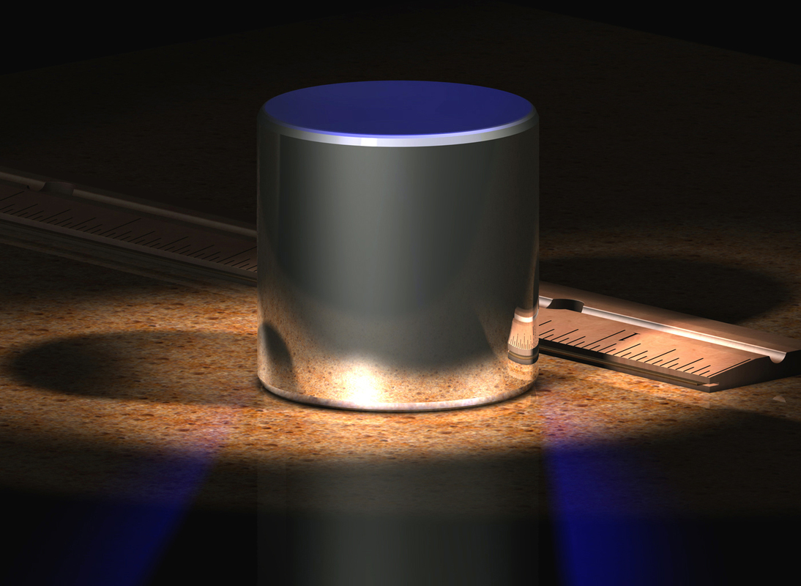

# A Level Physics OCR A

## **2** Foundations of physics

### **2.2** Making measurements and analysing data

---

<!-- _class: objectives -->

## **2.2.1** Measurements and uncertainties

1. systematic errors (including zero errors) and random errors in measurements

2. precision and accuracy

3. absolute and percentage uncertainties when data are combined by addition, subtraction, multiplication, division and raising to powers

4. graphical treatment of errors and uncertainties; line of best fit; worst line; absolute and percentage uncertainties; percentage difference

---

<!-- _class: objectives -->

## **1.2.2** Use of apparatus and techniques

1. use of appropriate analogue apparatus to record a range of measurements (to include length/ distance, temperature, pressure, force, angles and volume) and to interpolate between scale markings

2. use of calipers and micrometers for small distances, using digital or vernier scales

---

# What is an _error_?

- In everyday language, it can mean _mistake_.
- In computing, it means something has gone wrong.
- But in **physics**...
  > The error in a **measurement** is how _close_ it is to the true value.

---

# Accuracy and precision

These words are often confused.
What do they mean?

---

---

# Systematic and random errors

### Systematic error

> Errors caused by the equipment you are using. They do not vary from one measurement to another.

e.g. zero error, incorrect calibration

### Random error

> Errors which vary from one measurement to another.

e.g. timing errors from human judgment.

---

# Uncertainties

- The _uncertainty_ in a measurement is a degree of confidence in the value.
- It can be expressed as an _absolute_ or a _percentage_ value.

## Example

My height is 1.78 &#177; 0.01 m
The **absolute** uncertainty is _0.01_ m (1 cm).
The **percentage** uncertainty is 1/178 = _0.6%_.

---

# Uncertainties

## **Example**

The **resolution** of a ruler is 1 mm. What are the _absolute_ and _percentage uncertainties_ in the length of the pencil?

---

# Measurement circus

For each measurement, estimate the absolute and percentage uncertainties and identify and correct for any possible systematic errors.

---

# Further reading

- [OCR A Language of Physics](https://www.ocr.org.uk/Images/577377-language-of-measurement-in-context-physics.docx)
