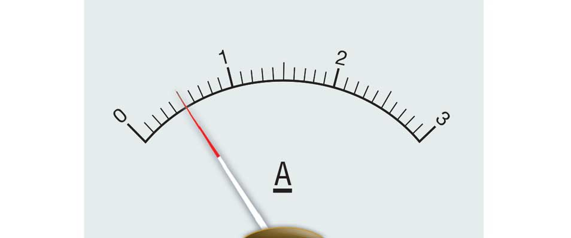

# :pen: Do It Now :straight_ruler:

State the absolute uncertainty and calculate the relative (percentage) uncertainty in these measurements.

1. A metre ruler is used to make a measurement of 1.51 m.
2. A micrometer is used to make a measurement of 2.43 mm.
3. 

---

# :pen: Answers :straight_ruler:

State the absolute uncertainty and calculate the relative (percentage) uncertainty in these measurements.

1. A metre ruler is used to make a measurement of 1.51 m.
   _1.51 &plusmn; 0.01 m &plusmn; 0.7%_
2. A micrometer is used to make a measurement of 2.43 mm.
   _1.51 &plusmn; 0.01 mm &plusmn; 0.4%_
3.  _0.5 &plusmn; 0.1A &plusmn; 20%_

---

# Learning Objectives

- calculate the uncertainty in a quantity which relies on one or more uncertain measurements

---

# Propagating uncertainties

Sometimes we make an **indirect measurement**.

For example:

- we measure **perimeter** by measuring side lengths of a rectangle
- we measure **resistance** by measuring potential difference and current
- we measure **acceleration** by measuring distance and time taken of a falling object

---

# The rules

Without any further explanation:

1. When adding _or_ subtracting quantities, we always **add** the **absolute** uncertainties
2. When multiplying _or_ dividing quantities, we always **add** the **percentage** uncertainties
3. Multiplying by a fixed constant multiplies the absolute uncertainty by that constant. It does not affect the percentage uncertainty.

---

<!-- _class: resistor-series -->

# Example 1

Two resistors in series have resistances of 4.0 &Omega; and 6.0 &Omega;. Calculate their total resistance and the uncertainty in the measurement.

- 4.0 &Omega;
-
- 6.0 &Omega;

---

# Example 2

An ammeter in series with a resistor reads 0.60 A and a voltmeter in parallel reads 1.2 V.

Calculate the resistance of the resistor.

---

# Example 3

A vernier calliper is used to measure the thickness of a stack of 50 sheets of card to be 12.7 mm.

What is the thickness of one sheet of card?

---

# Example 4

An A4 sheet of paper measures 210 x 197 mm, to the nearest mm.

Calculate the perimeter and the area, and the percentage uncertainties in these measurements.

---

# Example 5

A ball falls from rest through s = 1.00 &plusmn; 0.01 m, and is timed to take t = 0.45 s.

Calculate the acceleration due to free fall, g.

Use the equation $s=\frac{1}{2}gt^2$

---

# Example 6

A pendulum is timed to take 28.22 seconds for 20 swings.

Calculate the uncertainty in a **single** period.

---

# Further Questions

Try the examples on Isaac Physics.

---

# Appendix

### Mathematical reasoning for rules

1. When adding or subtracting quantities, we always add the absolute uncertainties.

Consider two measurements $a$ and $b$ with uncertainties $\delta a$ and $\delta b$.

$$
(a\pm \delta a) + (b\pm\delta b) = (a + b) \pm (\delta a + \delta b)\\
$$

$(a+b)$ is the sum of the measured values. $(\delta a + \delta b)$ is the sum of the absolute uncertainties.

---

2. When multiplying _or_ dividing quantities, we always **add** the **percentage** uncertainties

$$
(a\pm \delta a) \times (b\pm\delta b) = ab + a\delta b + b\delta a + \delta a \delta b
$$

$ab$ is the product of the two measured values. So the uncertainty is $a\delta b + b\delta a + \delta a \delta b$. Dividing by ab will give the percentage uncertainty.

This gives

$$
\frac{a\delta b + b\delta a + \delta a \delta b}{ab}=\frac{\delta b}{b} +\frac{\delta b}{a}+ \frac{\delta a \delta b}{ab}
$$

The last term is very small so we ignore, and the first two are the sum of the percentage uncertainties!
