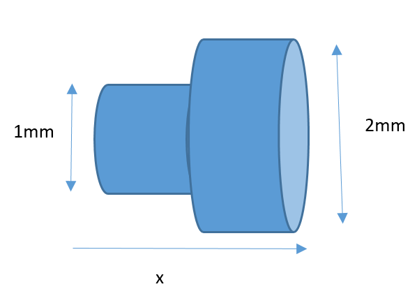

# :pen: Do It Now :zap:

1. :green_circle: State the direction of conventional current.
2. :green_circle: State the charge of a $SO_4^{2-}$ ion in coulombs.
3. :green_circle: Write down a typical charge carrier density for a conductor.
4. :orange_circle: A conductor has cross-sectional area of 1 mm$^2$. What is the cross-sectional area in m$^2$?
5. :red_circle: For the current junction shown below, sketch (a) current vs distance x (b) mean drift velocity vs x. .

---

# Learning Objectives

- Gain confidence in solving problems involving mean drift velocity, current, and charge.

---

$$I = Anev$$

# Worked Example

Estimate the mean drift velocity of electrons in a copper wire of diameter 0.25 mm carrying a current of 0.8 mA.

---

# :pen: Isaac C2 Charge Carriers

$e = 1.60 \times 10^{-19} \text{ C}$

1. If 0.035pC of charge is transferred via the movement of Al$^{3+}$ ions, how many of these ions must have been transferred in total?
2. If a 50μA current is flowing then how many electrons pass a point each minute to 2 significant figures?
3. In a bolt of lightning, 45nC flows to ground in 25ms. Work out the average number of charge carriers flowing past per second.
4. If $56 \times 10^{16}$ electrons flow to the ground in 0.035μs, work out the average current.

---

5. How long does it take for a current of 6.0A to deliver $1.5 \times 10^{17}$ Cu$^{2+}$ ions in a solution? Assume these ions are the only charged particles moving.

---
