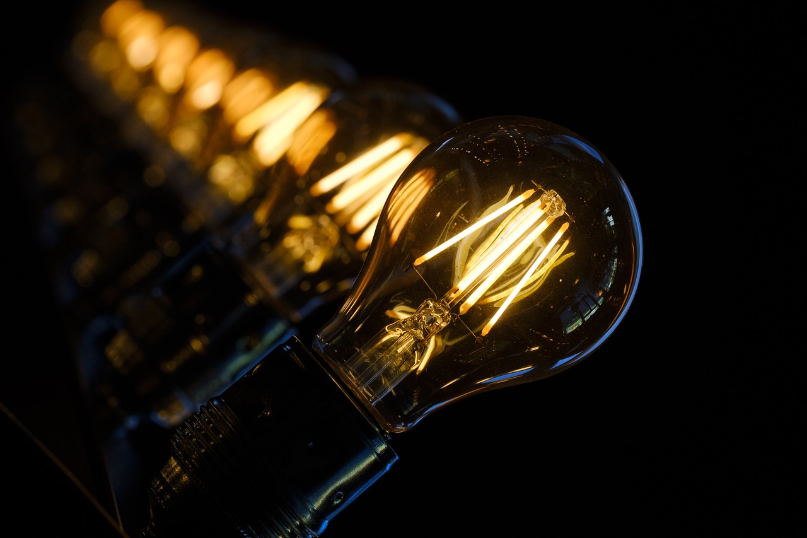

# A Level Physics OCR A

## 4 Electons, waves and photons

### 4.2 Energy, power, and resistance

---

# :pen: Do It Now

1. State the definition of p.d.
2. State the definition of emf.
3. State the definition of the volt.
4. A wire carrying a current I is formed by making a junction between two metals A and B. The charge carrier density of metal B is 4 times greater than A. The diameter of B is half that of A. If $v$ is the mean drift velocity in wire A, what is the mean drift velocity in wire B?

---

## 4.2.3 Resistance & IV characteristics

- resistance; $R = \frac{V}{I}$ ; the unit ohm ($\Omega$)
- Ohm's law
- I–V characteristics of resistor, filament lamp, thermistor, diode and light-emitting diode (LED); techniques and procedures used to investigate the electrical characteristics for a range of ohmic and non-ohmic components.
- light-dependent resistor (LDR); variation of resistance with light intensity.

---

# George Ohm

Discovered that the p.d. across a metal wire is proportional to the current

---

# Ohm's Law

> The potential difference across a conductor is **directly proportional** to the current through it.

$$V \propto I$$

This leads to the **definition** of electrical resistance as the constant of proportionality in this relationship:

$$V=IR$$

---

# Resistance and the Ohm

Resistance is **defined** as

$$R = \frac{V}{I}$$

Notice that it is **not necessarily** equal to the gradient of a IV graph - only in the special case where V is directly proportional to I (a metal wire).

---

# The Ohm

The Ohm &Omega; is equal to...

> The **electrical resistance** of an object which carries **one ampere** of current when **one volt** of potential difference is across it.

Learn this!

---

# I-V characteristics

---

---

#### Why does the resistance increase as the applied potential difference increase?

- increasing p.d. increases current
- current causes **resistance ($I^2R$) heating**
- the **temperature** of the wire increases (wire gets hotter)
- lattice ion vibration increases
- which causes more **frequent** lattice ion **collisions**
- hence resistance increases

---

# Investigating IV characteristics

---

### PAG 3.2 Investigating component characteristics

| CPAC                               | How to obtain tick                                                           |
| ---------------------------------- | ---------------------------------------------------------------------------- |
| 1 Follows written procedures       | Follow the instructions carefully                                            |
| 2 Applies investigative approaches | Demonstrate initiative in solving issues                                     |
| 3 Safely uses...                   | Turn equipment off after each reading, no short circuits, safe voltage limit |
| 4 Makes and records observations   | Record observations in a ruled table directly into lab notebook              |

---
