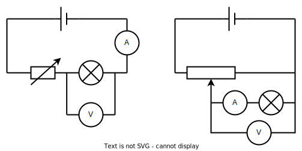

# A Level Physics OCR A

## 4 Electons, waves and photons

### 4.2 Energy, power, and resistance

---

## 4.2.3 Resistance & IV characteristics

- resistance; $R = \frac{V}{I}$ ; the unit ohm ($\Omega$)
- Ohm's law
- I–V characteristics of resistor, filament lamp, thermistor, diode and light-emitting diode (LED); techniques and procedures used to investigate the electrical characteristics for a range of ohmic and non-ohmic components.
- light-dependent resistor (LDR); variation of resistance with light intensity.

---

# George Ohm

Discovered that the p.d. across a metal wire is proportional to the current

---

# Ohm's Law

> The potential difference across a conductor is **directly proportional** to the current through it.

$$V \propto I$$

This leads to the **definition** of electrical resistance as the constant of proportionality in this relationship:

$$V=IR$$

---

# Resistance and the Ohm

Resistance is **defined** as

$$R = \frac{V}{I}$$

Notice that it is **not necessarily** equal to the gradient of a IV graph - only in the special case where V is directly proportional to I (a metal wire).

---

# The Ohm

The Ohm Ω is equal to...

> The **electrical resistance** of an object which carries **one ampere** of current when **one volt** of potential difference is across it.

Learn this!

---

# I-V characteristics

We can investigate IV characteristics using circuits like these. Which is better?

---
