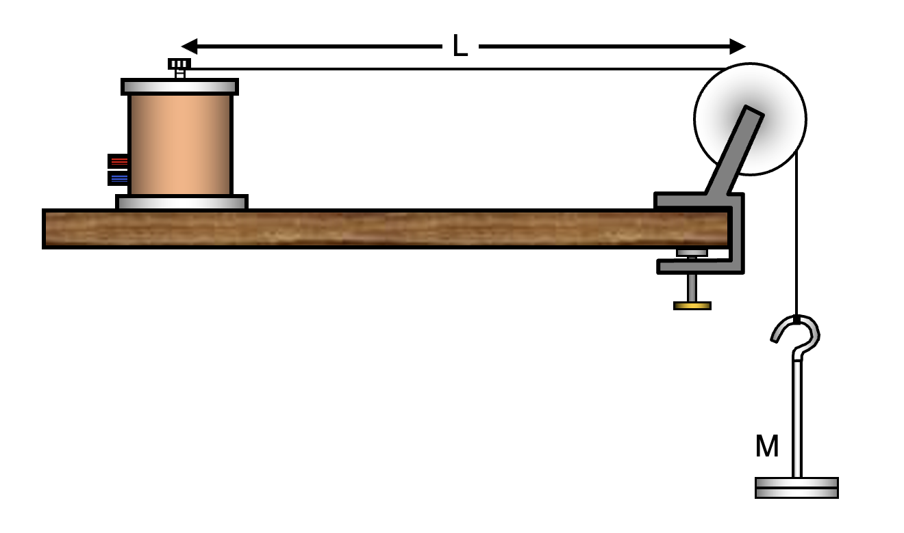

# Recap :sunglasses:

## Answer the starter questions!

---

# Answers

1. A
2. C
3. D

---

# Learning Objectives

- state the meaning of **fundamental frequency**
- calculate the frequency of **harmonics** of a string
- investigate using **Melde's experiment**

---

# Demonstration

<iframe src="https://www.compadre.org/osp/pwa/soundanalyzer/" height="100%"></iframe>

---

# Fundamental frequency

The **lowest frequency** that can be produced by a stationary wave pattern.

<wave-harmonics mode="1"></wave-harmonics>

On a string with fixed ends (e.g. a guitar string), the fundamental frequency corresponds to a wavelength of 2L, where L is the length of the string.

---

| Harmonic          | Shape                                      | Frequency | Wavelength     |
| ----------------- | ------------------------------------------ | --------- | -------------- |
| 1st (fundamental) | <wave-harmonics mode="1"></wave-harmonics> | $f_0$     | $2L$           |
| 2nd               | <wave-harmonics mode="2"></wave-harmonics> | $2f_0$    | $L$            |
| 3rd               | <wave-harmonics mode="3"></wave-harmonics> | $3f_0$    | $\frac{2L}{3}$ |
| 4th               | <wave-harmonics mode="4"></wave-harmonics> | $4f_0$    | $\frac{L}{2}$  |
| 5th               | <wave-harmonics mode="5"></wave-harmonics> | $5f_0$    | $\frac{2L}{5}$ |

---

# Melde's experiment

We could investigate

- varying frequency with fixed length and tension (**harmonics**)
- dependence of frequency on **length**
- dependence of frequency on **tension**

---

# Task

Follow the instructions on the worksheet.

---

## Plenary

<iframe src="https://phet.colorado.edu/sims/html/wave-on-a-string/latest/wave-on-a-string_en.html"
        width="100%"
        height="600"
        allowfullscreen>
</iframe>

---

# Further work

1. Find the frequencies of the first
