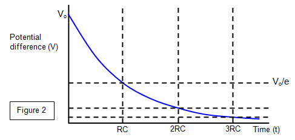

# :pen: Do It Now! :+1:

Concentrate on clarity of working (show correct equation etc.)

1. A 1000 μF capacitor stores 1000 μC of charge. How much energy does it store?
2. A capacitor is charged by constant current of 20 mA for 10s. It reaches 5V. How much energy is stored?
3. A 470 μF capacitor is charged to 6V. How much energy does it store?
4. Draw a circuit diagram which would allow you to rapidly charge a capacitor and discharge through a resistor.

---

# Solutions

Choose the correct equation to make your life easier and your working clearer!

1. $W=\frac{Q^2}{2C} = \frac{(1000 \times 10^{-3})^2}{2 \times 1000 \times 10^{-6}} = 500 \text{ J}$
2. $W=\frac{1}{2}QV = \frac{1}{2} \times 1000 \times 10^{-6} \times 5 = 2.5 \text{ mJ}$
3. $W=\frac{1}{2}CV^2$

---

4. 

---

## 6.1.3 Discharging capacitors

1. charging and discharging capacitor through a resistor; techniques and procedures to investigate the charge and the discharge of a capacitor using both meters and data-loggers

2. time constant of a capacitor–resistor circuit; $\tau=CR$

3. equations of the form $x=x_0 e^{-\frac{t}{CR}}$

4. graphical methods and spreadsheet modelling of the equation $\frac{\Delta Q}{\Delta t}=-\frac{Q}{CR}$

5. exponential decay graph; constant-ratio property of such a graph

---

# Derivation

- For the discharge circuit, show that $\frac{\Delta Q}{\Delta t}=-\frac{Q}{CR}$.
- Hence show that $Q=Q_0 e^{-\frac{t}{CR}}$ for a discharging capacitor.

;

---

# Derivation

Also show that:

- $V=V_0 e^{-\frac{t}{CR}}$
- $I=I_0 e^{-\frac{t}{CR}}$

---

# The meaning of CR

> The time taken during **discharge** for the capacitor to fall to 1/e ≈ 37% of the initial value of charge, current, or p.d.

;s

---

# Demonstration

Capacitor discharge.

---
