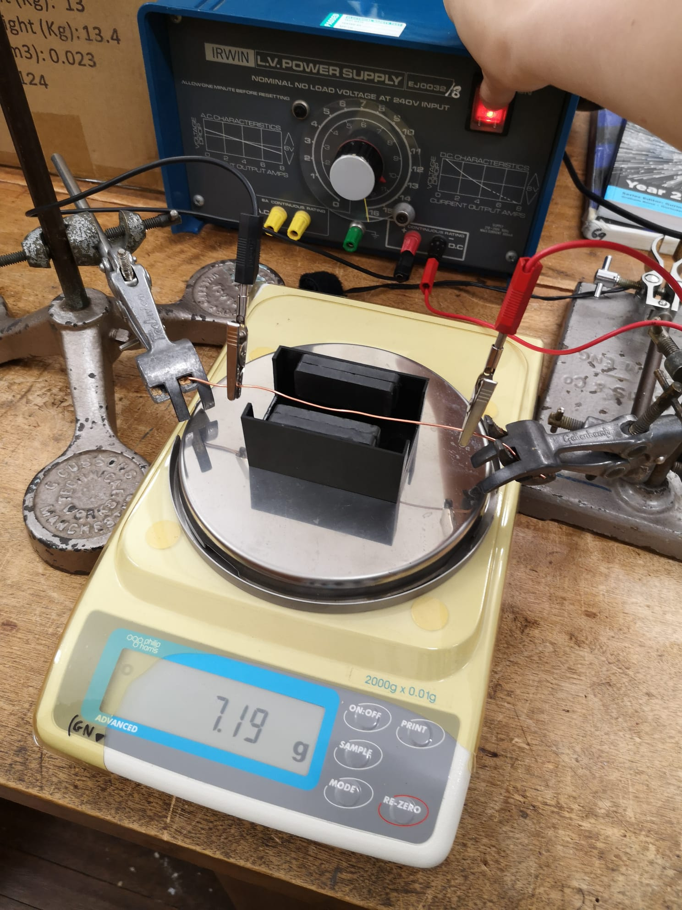

# A Level Physics OCR A

## 6 Particles and medical physics

### 6.3 Electromagnetism

---

# Prior knowledge check! :teacher:

- What can cause a magnetic field?
- What do we call the poles?
- Can you have a pole by itself?
- Can you remember how to draw the field around:
  - a wire?
  - a solenoid?

---

<!-- _class: objectives -->

## 6.3.1 Magnetic fields

1. magnetic fields are due to moving charges or permanent magnets

2. magnetic field lines to map magnetic fields

3. magnetic field patterns for a long straight current-carrying conductor, a flat coil and a long solenoid

4. Fleming’s left-hand rule

5. force on a current-carrying conductor $F=BIL \sin \theta$; techniques and procedures used to determine the uniform magnetic flux density between the poles of a magnet using a current-carrying wire and digital balance

6. magnetic flux density; the unit tesla

---

# Magnetic fields

Can be created by two things:

- permanent magnets :magnet:
- moving charges :zap:

---

# Field patterns

- magnetic field lines point from **north** to **south**
- a compass :compass: points from magnetic north to magnetic **south** :confused:

---

# Long straight wire

- right hand grip rule
- thumb points in direction of current
- fingers point in direction of field lines

---

<!-- _class: two-pane -->

# Solenoid

- right hand grip rule
- thumb points in direction of **field**
- fingers point in direction of current

---

# Magnetic flux density

- measures the strength of the magnetic field at a **point**
- unit: **tesla** (T)

---

<!-- _class: two-pane -->

# Fleming's left hand rule

- F is force in newtons
- B is magnetic flux density in tesla
- I is current in amperes

---

# Catapult field

---

# Force on a current carrying wire

$$F=BIL \sin \theta$$

---

# Current balance

- vary current
- measure force using balance
- plot F vs I
- gradient = BL
