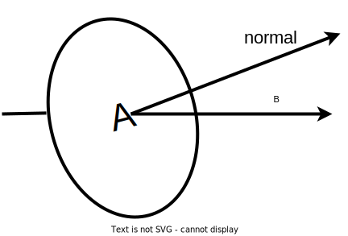

# A Level Physics OCR A

## 6 Particles and medical physics

### 6.3 Electromagnetism

---

<!-- _class: objectives -->

# 6.3.3 Electromagnetism

- magnetic flux $\phi$; the unit weber; $\phi = BA\cos \theta$
- magnetic flux linkage
- Faraday’s law of electromagnetic induction and Lenz’s law
- emf = rate of change of magnetic flux linkage $\epsilon = -\frac{\Delta(N\phi)}{\Delta t}$; techniques and procedures used to investigate magnetic flux using search coils
- simple a.c. generator
- simple laminated iron-cored transformer; $\frac{n_s}{n_p}=\frac{V_s}{V_p}=\frac{I_p}{I_s}$; techniques and procedures used to investigate transformers

---

# Magnetic Flux

$$\Phi = BA\cos \theta$$

- measure of the **number of field lines** passing through an **area**
- unit: _weber_ (Wb)
- 1 Wb = 1 Tm&sup2;

---

# Magnetic Flux Linkage

$$\text{flux linkage} = N\Phi$$

- the amount of flux linked to a coil
- N is the number of **turns** on the coil
- $\Phi$ is the **magnetic flux**
- flux linkage has units of _weber_ (Wb)

---

# Faraday's law

> The magnitude of the **induced emf** in a circuit is **directly proportional** to the **rate of change of magnetic flux linkage** _or_ the **rate of cutting of magnetic flux**.

$$\epsilon = -\frac{\Delta(N\phi)}{\Delta t}$$

The minus sign reminds us that the effect opposes the change which caused it (Lenz's law).

---

# Lenz's law

> The direction of the induced emf is such that the **current** which causes it to flow _opposes the change which produced it_.

Lenz's law is due to _conservation of energy_.

---

# The transformer
