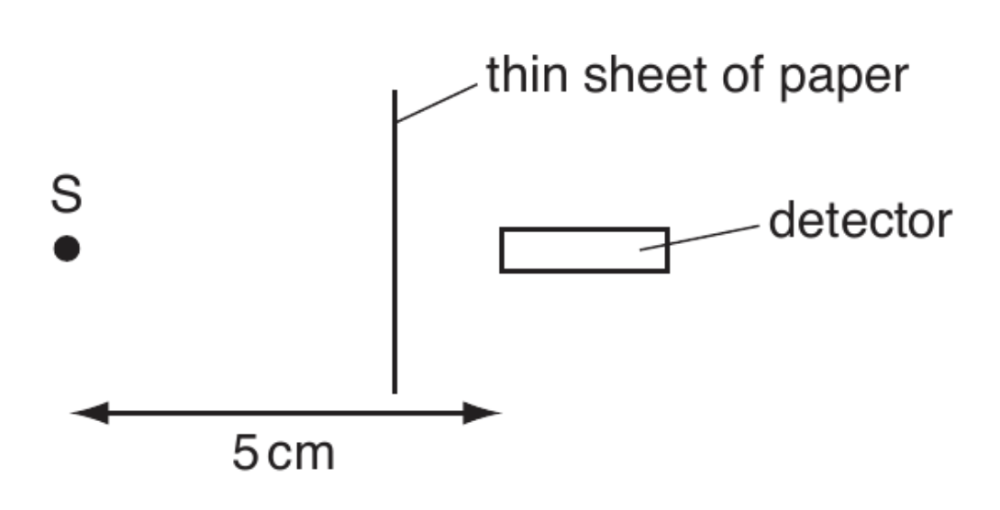

# :blue_book: Do It Now (please) :+1:

1. Name the unit of activity.
2. A radioactive source with a very long half-life is moved away from the radiation detector. What happens to (a) the measured count rate (b) the activity
3. State the relative mass of the neutron.

---

# Learning Objectives

## 4.2.1 (part 2) Types of Radiation

- List the forms of nuclear radiation (**alpha**, **beta**, **gamma**, and **neutron**)
- Describe the _penetrating power_, _range in air_, and _ionising power_ of alpha, beta, and gamma radiation
- Apply knowledge of radiation to _evaluate_ the best sources of radiation to use in a given situation

---

<!-- _class: none -->

### Properties of radiation

| type          | Mass | Charge | Ionising | Stopped by |
| ------------- | ---- | ------ | -------- | ---------- |
| alpha &alpha; |
| beta &beta;   |
| gamma &gamma; |
| neutron n     |

---

<!-- class: none -->
<!-- backgroundColor: lightgrey -->

# Alpha radiation

---

# Beta radiation

---

# Gamma radiation

---

<!-- backgroundColor: none -->

<!-- class: invert -->

# Ionising Power

## :thinking: Which are the most and least ionising forms of radiation?

---

## Demo: spark counter

Only very **ionising** radiation will activate the spark counter.

# :warning: :radioactive:

---

# Penetrating Power

## :thinking: which are the most and least penetrating forms of radiation? Why?

---

# Demo: Penetrating power

# :warning: :radioactive:

---

<!-- _class: none -->

# Penetrating power

---

### Properties of radiation

| type          | Mass   | Charge | Ionising | Stopped by        |
| ------------- | ------ | ------ | -------- | ----------------- |
| alpha &alpha; | 4      | 2      | most     | paper/few cms air |
| beta &beta;   | 1/2000 | -1     | middle   | sheet metal       |
| gamma &gamma; | 0      | 0      | least    | lead              |
| neutron n     | 1      | 0      | fairly   | thick concrete    |

---

# Smoke alarm

- Radiation beam passed across air gap to detector
- Alarm triggered if beam current falls too low

---

# Thickness monitoring

paper/lead/aluminium etc.

---

# Medical instrument sterilisation

---

## Uses of radiation

| Use                  | &alpha;/&beta;/&gamma;? | Reason |
| -------------------- | ----------------------- | ------ |
| smoke alarm          |
| thickness monitoring |
| radiotherapy         |
| sterilisation        |

---

%20QP%20-%20Paper%201%20CIE%20Physics%20IGCSE/Q39.png>)

---

%20QP%20-%20Paper%201%20CIE%20Physics%20IGCSE/Q39.png>)

---

<!-- class: multi-choice -->

#### S is a radioactive source emitting &alpha; particles, &beta; particles and &gamma; rays.

**Which radiations can be detected?**

- &alpha; and &beta;
- &alpha; and &gamma;
- &beta; and &gamma;
- &alpha;, &beta; and &gamma;
