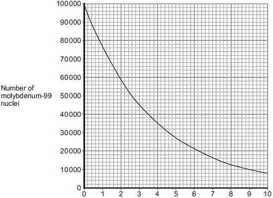

# 4 Atomic structure
## 4.2 Atoms and nuclear radiation
### 4.2.3 Half-lives and the random nature of radioactive decay

---

# :blue_book: Do It Now :raised_hands:

1. Name a type of radioactive decay that keeps the mass number the same.
2. State the unit of electrical resistance.
3. Give one difference between the particles in a solid and the particles in a liquid.
4. Name Thomson's model of the atom.
5. A radioactive source emits particles that pass through paper but are absorbed by a thin sheet of metal. What are they?

---

## 4.2.3 Half-lives

- explain the concept of half-life and how it is related to the random nature of radioactive decay.
- Determine the half-life of a radioactive isotope from given information.
- _Calculate the net decline, expressed as a ratio, in a radioactive emission after a given number of half-lives._

---

## Radioactive decay is **random**

- Get yourself a die! :game_die:
- Stand up. You are undecayed atoms.
- Each turn we all roll **once**.
- Sit down if you have **decayed**.

---

# Half-life

> The **time taken** for the **number of undecayed nuclei** to decrease to half of the initial value.

The **activity** and **count-rate** also decrease to half of the initial value.

---

# :thinking: Example

A sample of radioactive material is meassured to have an activity of 500 Bq. After six hours the measured count rate is 125 Bq.

### What is the half-life?

---

### Example
A sample of radioactive material is meassured to have an activity of 500 Bq. After six hours the measured count rate is 125 Bq.

#### Solution

125 is one-quarter of 500. One-quarter is **two half-lives**. So the half-life is **3 hours**.

---

### :memo: The activity of a radioactive substance falls from 1000 Bq to 125 Bq in 12 minutes. What is the half-life?

---

### :memo: The activity of a radioactive substance falls from 1000 Bq to 125 Bq in 12 minutes. What is the half-life?

## Answer: 4 minutes

---

## :memo: The half-life of a radioactive isotope is 30 minutes. If the initial number of undecayed nuclei is 2000, how many will remain after 1.5 hours?

---

#### :memo: The half-life of a radioactive isotope is 30 minutes. If the initial number of undecayed nuclei is 2000, how many will remain after 1.5 hours?

### Answer: 250

three half-lives in 1.5 hours = 1/8

---

---

# Questions

1. Answer the sheet on radioactive carbon dating.
2. A 100 g sample of wood has an initial count rate of 20 Bq. Sketch a graph **on graph paper** showing activity vs time for a period of 30,000 years. The half-life of carbon-14 is 5730 years.
3. If the background-count rate is 0.33 Bq, how long is it reasonable to use racioactive carbon dating for?

---

# Half-life experiment

1. Draw a table:

| turns | N remaining |
|---|---|
| 0 | 100 |
| 1 | ... |

---

# Half-life experiment

2. Roll **all** the dice :game_die:
3. Remove any which have a black face up. :black_circle:
4. Count the number N remaining and record in table.
5. Repeat from 2 until 10 turns or you have no dice left.

---

# Analysis

6. Plot a graph of N vs turns. :chart_with_downwards_trend:
7. Draw a smooth line of best fit through your points.
8. Identify the half-life :radioactive: from your graph (draw a line from N=50, and down to find the number of turns needed).
9. Stick in your :blue_book:

---

# What now?

Complete the questions from page 101 of your textbook.