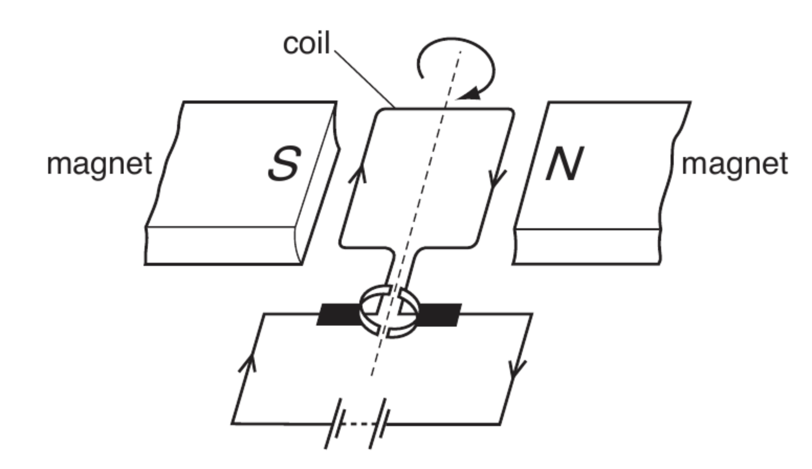

# 7 Magnetism and electromagnetism

## 7.2 The motor effect

### 7.2.3 Electric motors (HT) and loudspeakers (HT)

---
<!-- _class: questions -->

# :blue_book: Do It Now!

- In **Fleming's left hand rule**, what does each finger represent?
  - the **th**umb is...
  - **F**irst finger is...
  - se**C**ond finger is...
- Sue uses a lever to open a paint tin with a screwdriver. Should she use a **long** or a **short** screwdriver? Why?
- **B** is the symbol for magnetic flux d..
- What's the equation describing the force on a current carrying wire?
- What angle is between the current and field for this equation to work?

---
%20QP%20-%20Paper%201%20CIE%20Physics%20IGCSE/Q33.png)

---

<!-- _class: objectives -->

## 7.2.3 Electric motors (HT) and loudspeakers (HT)

- _explain_ how the **force** on a **conductor** in a magnetic field causes the **rotation of the coil** in an electric motor.
- _explain_ how a moving-coil **loudspeaker** and **headphones** work.

---

---

<iframe src="https://www.walter-fendt.de/html5/phen/electricmotor_en.htm"  height=100%></iframe>

---

<!-- _class: questions -->

# Questions

- On your diagram, draw and label
  - **field lines** with B
  - **force** arrows on opposite sides of coil F
  - split ring **commutator**
  - low friction graphite **brushes**
- Explain why the motor rotates **continuously**.
- List some ways to make the motor turn _faster_.
- Explain why there is **no force** on the far (top) and near (bottom) side of the coil.
- The left and right sides of the coil have a length of 5cm and a current of 1.5 A. They have a force of 0.25 N. Calculate the magnetic flux density.
- The coil has a width of 3cm. Calculate the **moment** of the coil.

---

# Factors to increase the rate of rotation of the dc motor

* increase the **current**
* increase the **magnetic flux density**
* increase the **number of turns**

---

# Explain why the motor rotates continuously

- the sides of the coil (parallel to the magnet) experience a **force** (in opposite directions)
- the forces cause **moments** that act in the same (clockwise / anticlockwise) direction
- the **moments** cause the coil to rotate (clockwise / anticlockwise)
- (each half-revolution) the two halves of the (rotating) **commutator** swap from one (carbon) brush to the other

---

---

# Describe how the loudspeaker produces a sound wave

- **current** creates a magnetic field (around the coil)
- interacts with the **permanent magnet field**
- producing a **force** causing the coil/cone to move
- when **direction** of the current reverses, the direction of the (resultant) force reverses

---

